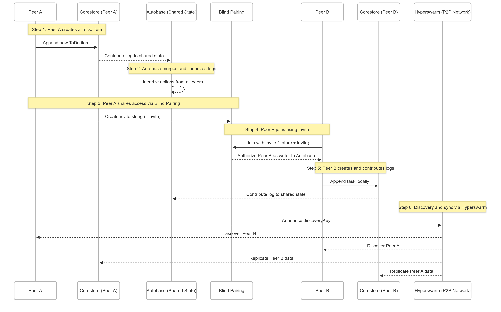

## Architecture Overview
The application is built using a **modular peer-to-peer architecture**, where each component plays a distinct role:

### 1. Corestore — Local Data Storage
Each user (or "peer") has their own **Corestore**, which stores their personal append-only logs using [Hypercore](https://hypercore-protocol.org/).

**Purpose:**

* Keeps track of a user’s own edits (e.g., added/marked ToDo items)
* Works like a local database for P2P applications
* Lives under folders like `store-a/` and `store-b/`

---

### 2. Autobase — Shared State Across Peers
Autobase combines all of the individual peer logs from Corestore into a single **linearized view** of the application state. This is based on **event sourcing** — tasks are added as events.

**Purpose:**

* Merges inputs from all writers
* Ensures tasks are applied in the same order across all users
* Supports reordering and rebuilding the view consistently if causal forks occur

**Example:**
If Peer A adds task `Buy Milk` and Peer B marks it as done, Autobase linearizes both actions and the view reflects it correctly for all peers.

---

### 3. Blind Pairing — Secure Sharing of the Autobase
Blind Pairing lets a user share access to their Autobase with another user **without revealing the actual key upfront**.

**Purpose:**

* Creates a temporary “invite” encoded with cryptographic info
* Allows peers to join securely even without a server
* Used to initiate collaboration between Peer A (inviter) and Peer B (invitee)

**How it works:**

* Peer A runs the app with `--invite` and gets an invite string
* Peer B runs the app with `--store=store-b 'invite:<string>'`
* After the handshake, Peer B is authorized as a writer to the Autobase

---

### 4. Hyperswarm — Peer Discovery & Networking
Hyperswarm is a decentralized networking layer that connects peers over a **distributed hash table (DHT)**, without needing a central server.

**Purpose:**

* Enables peer discovery using the Autobase's `discoveryKey`
* Encrypts and manages secure connections
* Replicates Hypercore data between peers

**Example:**
Once both peers know the `discoveryKey` from the Autobase, they “swarm” using Hyperswarm to find each other and start syncing.

---

## Summary

1. Peer A starts a Corestore and Autobase
2. Peer A generates an invite using Blind Pairing
3. Peer B joins with that invite and connects via Hyperswarm
4. Both peers replicate data using Hypercore over Hyperswarm
5. Autobase linearizes logs from both users to create a shared task view
6. Corestore saves the view persistently, allowing recovery on restart
